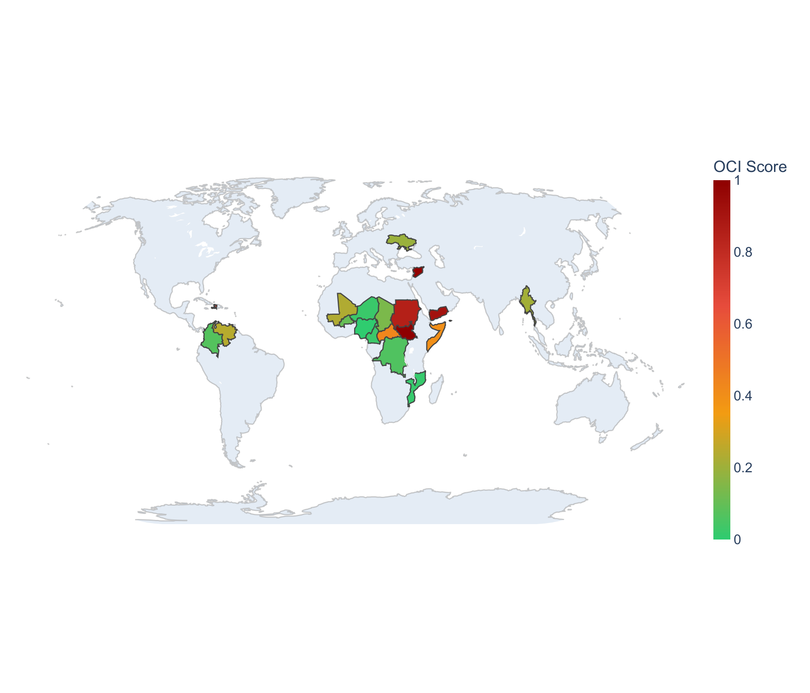
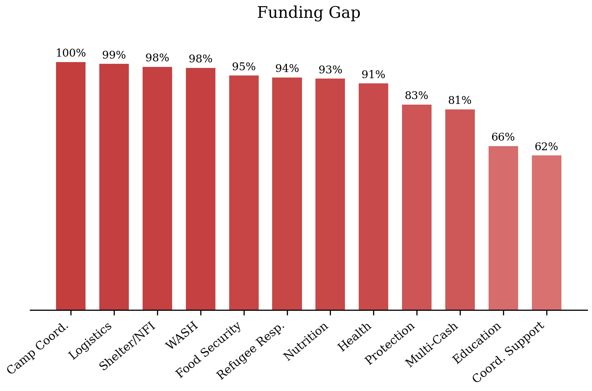
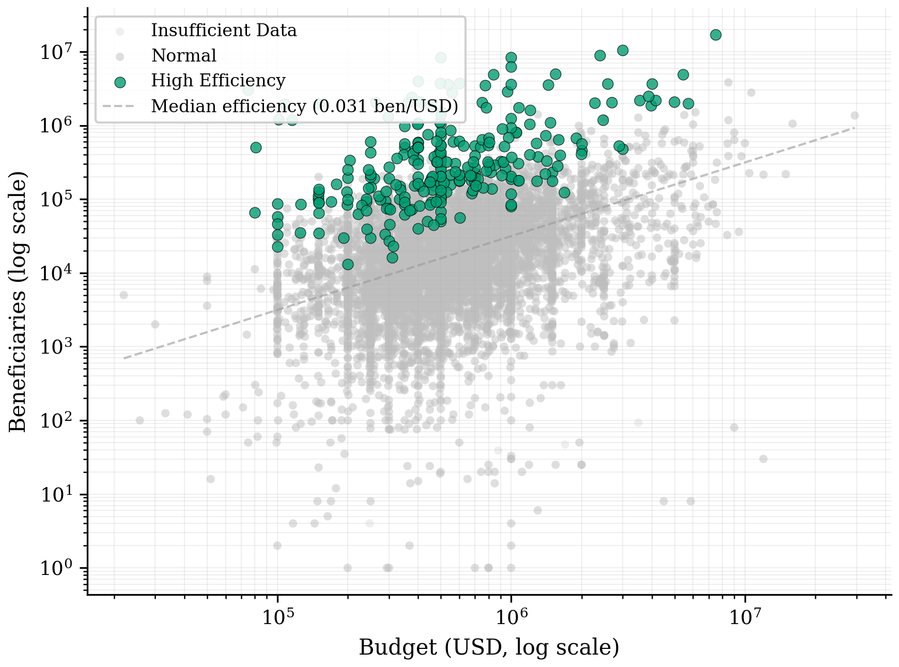
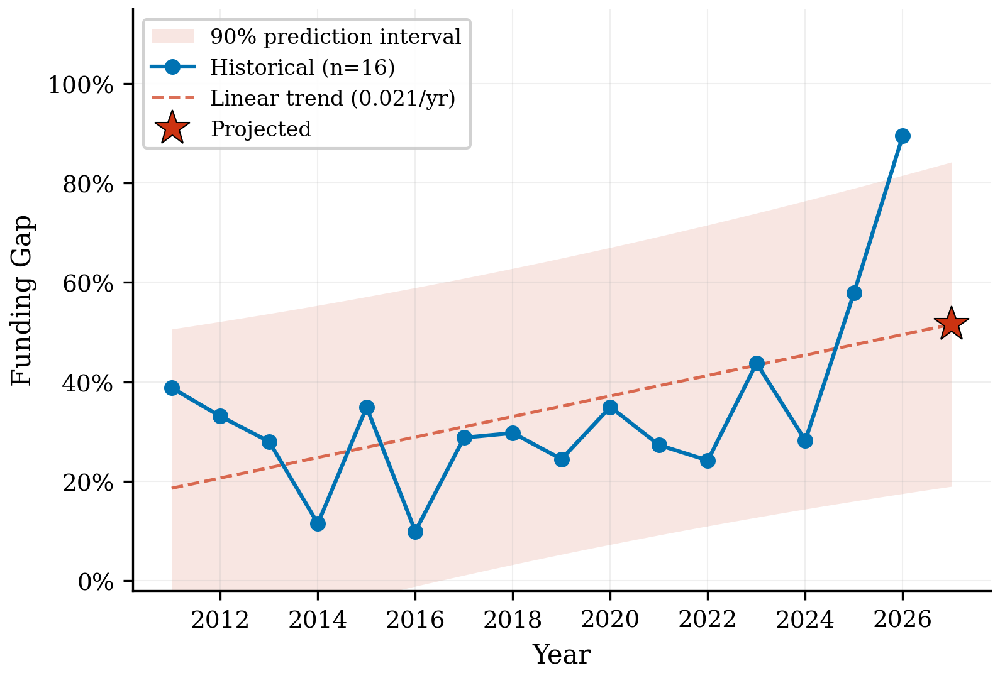

# CrisisLens

### The world funds crises it sees. CrisisLens finds the ones it doesn't.

**Hacklytics 2026 — Databricks x United Nations Geo-Insight Challenge**

---

## The Problem

In 2026, **300+ million people** need humanitarian assistance worldwide. But funding doesn't follow need — it follows headlines. Crises like Ukraine and Palestine receive extensive media coverage and proportionally more funding, while equally severe emergencies in South Sudan, Chad, and the Central African Republic remain chronically invisible and underfunded.

There is no systematic way for OCHA or donor agencies to detect which crises are being **overlooked** — simultaneously severe, underfunded, *and* invisible in global discourse.

## What CrisisLens Does

CrisisLens computes an **Overlooked Crisis Index (OCI)** — a multi-signal score that identifies humanitarian crises the world is missing. It combines four data dimensions that no single existing tool integrates:

| Signal | What It Measures | Source |
|--------|-----------------|--------|
| **Severity** | People in need as a fraction of population, quantile-binned 1–5 | OCHA HNO |
| **Funding Gap** | How much of the required funding is missing (0–100%) | OCHA FTS |
| **Population Impact** | Absolute scale of need normalized by country population | COD-PS + UN WPP |
| **Media Neglect** | How invisible the crisis is in global public attention | Google Trends |

```
OCI = (PIN/Population × Severity × Funding Gap) × (1 + Media Neglect × 0.2)
```

Higher OCI = more overlooked. The media multiplier ensures that crises which are underfunded **and** invisible rank higher than those which are underfunded but at least visible.

<p align="center">
  
</p>

### Key Findings

- **South Sudan (OCI 1.000), Syria (0.982), and Yemen (0.915)** are the three most overlooked crises — high severity, deep funding gaps, and minimal media attention create a **triple-neglect pattern**
- The mean funding gap across all tracked crises in 2026 is **91.7%** — most response plans are far below requirements
- **13 crises** receive less than 30% of the global median media attention despite having millions in need
- **12 crises** have statistically widening funding gaps (p < 0.1), signaling worsening neglect under current trends
- **265 benchmark CBPF projects** achieve a median beneficiary-to-budget ratio **15.6x higher** than the remaining projects — scaling these models could dramatically improve cost-effectiveness

---

## Features

### Interactive Geo Map
Choropleth world map colored by OCI score with four switchable layers (OCI, Funding Gap, People in Need, Media Neglect). Click any country to see an instant crisis brief and full breakdown.

### Crisis Intelligence Briefs
Every country view includes an auto-generated 3-sentence intelligence summary synthesizing severity classification (Extreme/Severe/Serious/Stressed/Minimal derived from PIN/population thresholds), funding gap, media visibility, and the most critically underfunded sector. Template-driven with no LLM dependency — updates dynamically as users navigate.

### Crisis Drilldown
Per-country analysis showing OCI component decomposition, cluster-level funding gaps (WASH, Health, Food Security, etc.), historical funding trends, and a full intelligence brief. Flags critically underfunded clusters that are >1.5 standard deviations above the country average.

<p align="center">
  
  <br><em>Cluster-level funding gaps for South Sudan, 2026 — Camp Coordination at 100%, Logistics at 99.3%</em>
</p>

### Efficiency Outlier Detection
Z-score analysis on beneficiary-to-budget ratios across 8,000+ CBPF projects. Identifies high-efficiency benchmarks and low-efficiency outliers using log-transformed ratios within each cluster-year group.

<p align="center">
  
  <br><em>Budget vs. beneficiaries across 8,091 CBPF projects — green = high-efficiency benchmarks</em>
</p>

### Project Recommender
Cosine similarity search on project feature vectors (cluster, organization type, budget, beneficiaries). Given any underperforming project, surfaces the most comparable high-efficiency benchmarks from other contexts.

### Funding Forecast
Linear regression with **90% prediction intervals** on historical funding gap trajectories. Identifies crises where the gap is statistically widening — an early warning system for proactive funding reallocation.

<p align="center">
  
  <br><em>South Sudan funding gap trend with 2027 projection and 90% confidence interval</em>
</p>

### Reallocation Simulator
Interactive policy tool with three controls: reallocation percentage (0-30%), recipient OCI threshold, and donor funding gap threshold. Redistributes funding from well-funded crises to the most overlooked, proportional to OCI score. Shows before/after funding gap comparison, sensitivity analysis across reallocation levels, estimated additional people reached, and donor/recipient breakdowns. Turns OCI from a diagnostic into a prescriptive decision-support tool.

---

## Architecture

```
Data Sources (HNO, FTS, COD-PS, CBPF, Google Trends)
        │
        ▼
  data_loader.py ──► Raw download + cache (data/raw/)
        │
        ▼
  oci_calculator.py ──► OCI formula + normalization
        │
        ├──► oci_scores.csv (per country-year)
        ├──► outlier_detector.py ──► Z-score efficiency flags
        └──► similarity_engine.py ──► Cosine similarity recommender
                    │
                    ▼
            Streamlit App (6 pages)
                    │
                    ▼
        Databricks Notebook (Delta Lake + Spark SQL)
```

All raw data access goes through `utils/data_loader.py`. Pages never read CSVs directly. Processed outputs are cached in `data/processed/` and reused across the Streamlit app and Databricks notebook.

---

## Setup

```bash
# Install dependencies
pip install -r requirements.txt

# Download data and compute OCI scores
python utils/data_loader.py

# Launch the dashboard
streamlit run app.py
```

The data pipeline downloads all datasets from [UN HumData](https://data.humdata.org/) and the [CBPF API](https://cbpf.data.unocha.org/), computes OCI scores with media attention data, and caches results. Total setup time: ~2 minutes.

### Databricks

The full analytical pipeline is also available as a Databricks notebook (`notebooks/full_pipeline.ipynb`) that writes all outputs to Delta tables for SQL access and downstream dashboarding.

---

## Data Sources

| Dataset | Source | What It Provides |
|---------|--------|-----------------|
| **HNO** | [OCHA HPC](https://data.humdata.org/dataset/global-hpc-hno) | People in need, targeted populations (2024–2026) |
| **FTS** | [OCHA FTS](https://data.humdata.org/dataset/global-requirements-and-funding-data) | Funding requirements vs. actuals per country-year |
| **COD-PS** | [HDX Population](https://data.humdata.org/dataset/cod-ps-global) | Country population for normalization |
| **CBPF** | [OCHA CBPF API](https://cbpf.data.unocha.org/) | 8,000+ project-level budgets and beneficiary counts |
| **Google Trends** | [pytrends](https://pypi.org/project/pytrends/) | Search interest as a proxy for media attention |

Population fallbacks from UN World Population Prospects 2024 are included for 9 crisis countries missing from COD-PS (Yemen, Syria, Myanmar, Ukraine, CAF, Palestine, Libya, Iraq, Lebanon).

---

## Tech Stack

| Purpose | Library |
|---------|---------|
| Data processing | pandas, NumPy |
| Statistical analysis | SciPy (`linregress`, prediction intervals), scikit-learn |
| Similarity search | scikit-learn (cosine similarity, OneHotEncoder, MinMaxScaler) |
| Media attention | pytrends (Google Trends API) |
| Visualization | Plotly (choropleth, scatter, bar, subplots) |
| Web application | Streamlit |
| Scalable processing | PySpark, Delta Lake (Databricks) |

---

## Research Paper

A companion research paper is included in `paper/main.tex` with full methodology, results, and discussion. The paper documents:

- Formal definition of the OCI with mathematical notation
- Detailed analysis of 65 country-year observations across 24 crisis contexts
- Efficiency outlier analysis across 8,091 CBPF projects (265 benchmarks identified, 15.6x median efficiency ratio)
- Funding trajectory forecasts with statistical significance testing
- Limitations and policy recommendations

> **Citation:** Vu, A., Maldaner, M., Abichou, R., & Hur, J. (2026). *Crisis Lens: The Overlooked Crisis Index for Humanitarian Funding Gaps.* Hacklytics 2026.

---

## Team

**Andrew Vu** — University of Florida
**Matheus Maldaner** — University of Florida · [@matheusmaldaner](https://github.com/matheusmaldaner)
**Raami Abichou** — University of Florida
**Jeremy Hur** — Georgia Institute of Technology

Built at **Hacklytics 2026**, Georgia Tech.

---

*CrisisLens — because the crises that don't make headlines still need funding.*
